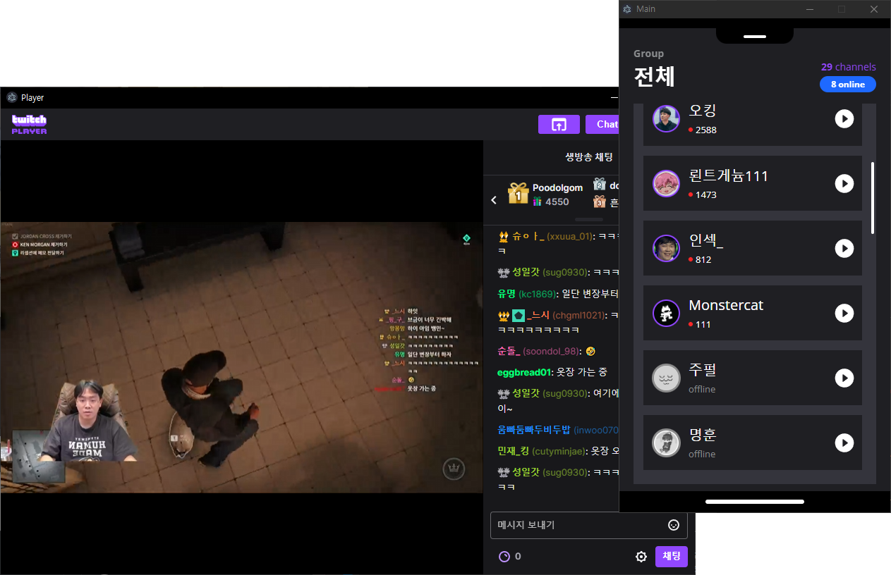

# twitch player

<div style="text-align:center">

### you can download for windows and mac 😎🎉



</div>

## Naming rules

components which are used as view => 

```js
  @customElement("view-*");
```

components which are used as reusable components => 

```js
  @customElemtn("component-*")
```

## caution

addWorkerListner should strictly type checking needed